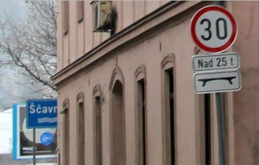
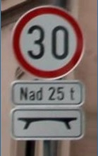

# SpeedSignRecognition
Speed traffic sign (+ complementary board) detection and recognition algorithm

Uses:
 * C++
 * OpenCV 3.2

## Algorithm:
1. Canny edge detection
2. Ellipse detection with conditions:
	* valid size
	* x, y axis comparison
	* ellipse, contour comparison
3. Ellipse interior rectification (using affine transform)
4. Number detection using a NN + filtering:
	* size filtering
	* gibberish NN result filtering
5. Complementary board detection and rectification under the speed sign:
	* aproximation of contours with polygons
	* finding proper 4 point polygons
	* rectification
6. Cropping of the speed sign and its complementary board(s), printing of detected speed limit

There's also a "backup" procedure doing dilation on Canny edges, which works when the sign is quite close to the camera but the picture quality is bad.

### NN:
The NN was trained on digits from _The Chars74K dataset_ by T. de Campos, with 1016 samples per digit (total of 10160 samples). Accuracy on the learning dataset was 99.94 %.

Topology:

* layer 1: 784 neurons (28x28 img size)
* layer 2: 160 neurons
* layer 3: 10 neurons (10 output digits)

### Performance:
On a i7 4700MQ, processing for 1 frame requires 9-23 _ms_ for video with downsizing to 1000xN or Nx1000, where N <= 1000.

The real-life speed limit detection accuracy is quite good.

## Output example:

input image:

</img>

output image:

</img>

_Detected speed limit: 30_

